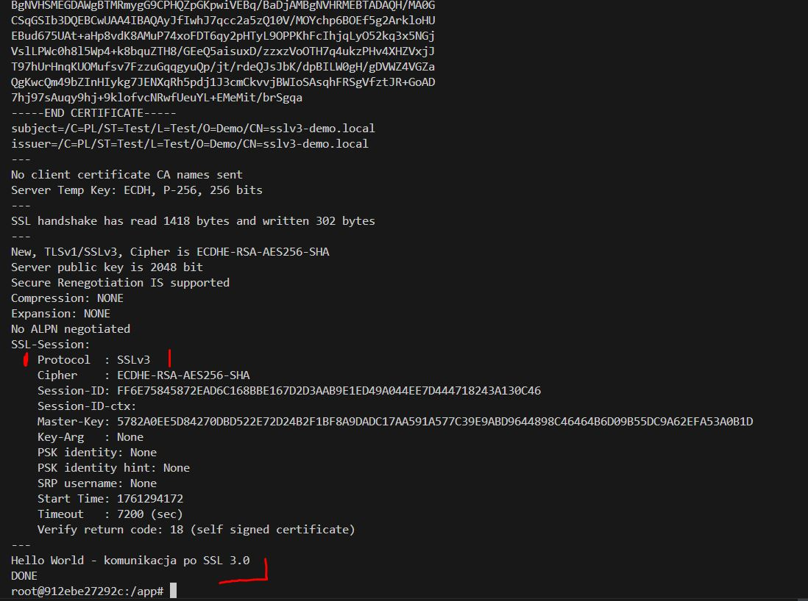
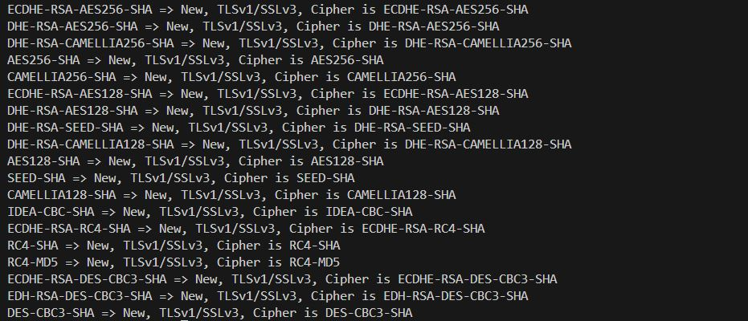

### Forcing SSL 3.0 Connection on a misconfigured OpenSSL server
openssl s_client -connect 127.0.0.1:4433 -ssl3

### Example of a successful SSL 3.0 connection establishment and message sending

### List of SSL 3.0 supported ciphers on the server (some of them are definitely unsafe)

